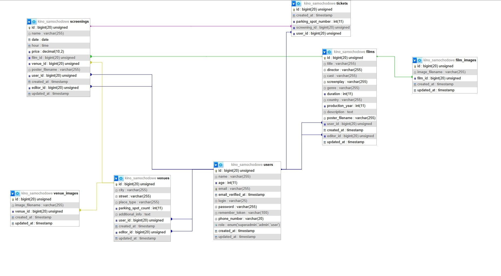

# 🎬 System Zarządzania Kinem Samochodowym (v2.1)

Kompleksowa aplikacja webowa do obsługi sprzedaży biletów oraz seansów kina samochodowego. Projekt jest rozwinięciem autorskiej aplikacji z czystego PHP, przeniesionym na framework Laravel w celu optymalizacji struktury i poprawy bezpieczeństwa danych.

## 🗄️ Architektura Danych (ERD)
Sercem aplikacji jest autorska, relacyjna baza danych MySQL. Projekt struktury kładzie nacisk na spójność danych (klucze obce, więzy integralności) oraz wydajność zapytań przy procesach rezerwacyjnych.

*Logika bazy uwzględnia zaawansowane relacje (1:N, M:N) pomiędzy użytkownikami, seansami a dynamicznie przydzielanymi miejscami parkingowymi.*

## 🚀 Funkcjonalności

### Zarządzanie Danymi (Panel Administratora)
* **Administracja Zasobami:** Pełne zarządzanie bazą filmów, seansów oraz parametrami miejsc seansu.
* **Analityka Rezerwacji:** Podgląd i modyfikacja statusów biletów, monitorowanie obłożenia miejsc parkingowych oraz zarządzanie bazą użytkowników.
* **Hierarchia Uprawnień:** System ról (Główny Administrator / Administrator) kontrolujący dostęp do wrażliwych danych systemowych.

### Moduł Użytkownika
* **Przegląd Ofert:** Dynamiczne wyświetlanie aktualnych seansów pobieranych z bazy.
* **Proces Transakcyjny:** Wybór miejsca na interaktywnym planie parkingu, walidacja dostępności w czasie rzeczywistym i zakup biletu (wymagana autoryzacja).
* **Zarządzanie Biletami:** Możliwość rezygnacji z transakcji z automatyczną aktualizacją statusu miejsca w bazie.
* **Generowanie Identyfikatorów:** Tworzenie unikalnych kodów QR z danymi użytkownika dla potrzeb weryfikacji wjazdowej.

## 🛠️ Technologie
* **Backend:** PHP 8.2.4 (Laravel 12.20.0), JavaScript.
* **Baza danych:** MySQL (Relacyjne modelowanie danych).
* **Integracje:** PHPQRCode (Generowanie unikalnych kluczy dostępu).
* **Frontend:** HTML, CSS (layout zorientowany na użyteczność procesową).

---
*Dokumentacja interfejsu graficznego:* [Link do PDF](https://github.com/MatemXVI/kino-samochodowe-laravel/blob/main/Interfejs_graficzny.pdf)  
*Pierwsza wersja (Raw PHP):* [GitHub Repository](https://github.com/MatemXVI/kino_samochodowe)
